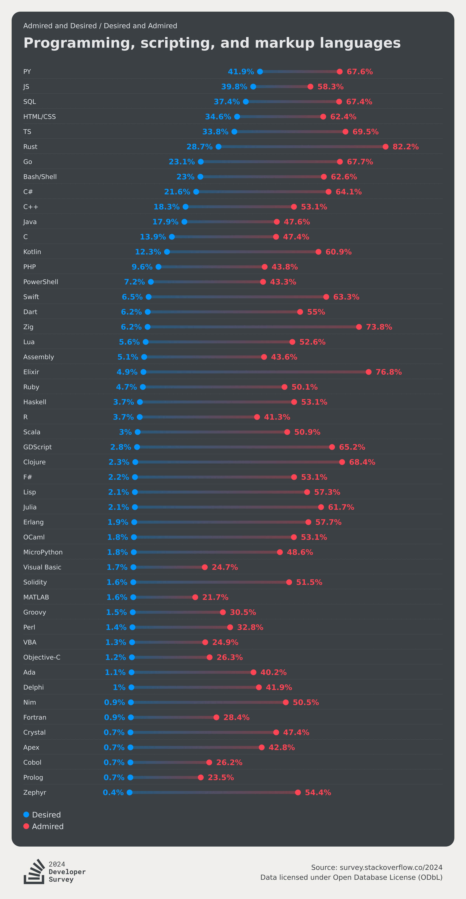

# project-dv25-11 Progress Report

All work was performed by [Matthias De Smet](@matthdsm)

## Data acquisition

The data was acquired from the [StackOverflow Developer Survey 2024](https://survey.stackoverflow.co/datasets/stack-overflow-developer-survey-2024.zip) and is available in the `src/data` directory as a compressed CSV file.

## Data loaders

I used a simple python script to extract the relavant columns from the CSV file and export to JSON format, which is then used in the visualizations.
Data is loaded using the `FileAttachment` API from Observable.

## Visualizations

We load the data for each visualiation separately on page load. This does increase the network traffic but allows us to keep the visualizations modular and independent of each other. Since the entirety of the dataset is quite large,  I think this trade-off is acceptable.

### Technology plot
The `technology` plot is meant to be a simpler copy of the one shown below:

The point is to visualize a list of the most admired and desired programming languages.
To simplify the visualization, I will use the absolute count of answers, rather than a percentage and show the data as a diverging stacked bar chart, where the left side shows the most desired languages and the right side shows the most admired languages, as shown in the example below:

Further iterations should include a functional tooltip with relevant information and a more polished design. I should also consider reverting to showing percentages to give a better overview of the data.

In the following plot, I added a select element to choose a programming language to see its distribution across different developer types. This provides insights into how various programming languages are perceived and utilized by different segments of the developer community.

### Developer profile plot

Interactive visualistion where the user can select a country and see the distribution of developer types in that country in a stacked waffle chart.
This should be a combination of the data visualized [here](https://survey.stackoverflow.co/2024/developer-profile#4-developer-type) and [here](https://survey.stackoverflow.co/2024/developer-profile#5-geography)

In a first attempt, I created a simple stacked waffle chart that shows the number dev's for each of the developer types per country. This resulted in an unreadable chart, because of the large number of countries.

I decided to make the chart interactive, so that the user can select a country and see the distribution of developer types in that country.

This resulted in a poorly designed chart, that is not very readable and does not show the data in a meaningful way. I will need to iterate on this design to make it more readable and useful.

In the end I opted the show a bar chart with the number of developers per type for the selected country, as shown below:

## Future work

Future work should include expanding on the number of sections and visualizations, as well as improving the design and underlying code.

Existing visualizations could do with some extra polishing and bugfixes, such as the technology plot, which currently does not show the tooltip correctly.

Nice to have features for the developer profile plot would to add a clickable map to select a country, rather than a dropdown. I should also investigate other types of visualizations, such as pie charts to better represent the data.