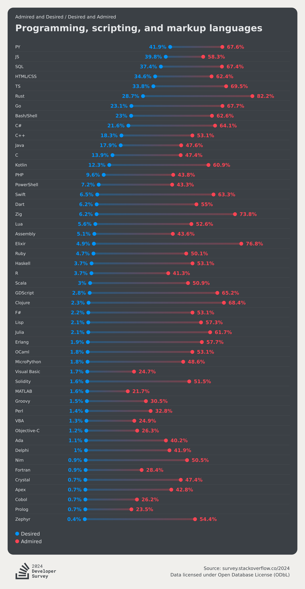

# Technology

This visualisation will be a verbatim copy of the one shown [here](https://survey.stackoverflow.co/2024/technology/#2-programming-scripting-and-markup-languages).

## TODO

- Merge both graphs into one

```js

import * as Plot from "npm:@observablehq/plot";
const TechnologyResults = FileAttachment("./data/technology_results.json").json();
```

```js
display(TechnologyResults);
```

```js

Plot.plot({
    marginLeft: 100,
    marginRight: 100,
    x: {
        axis: "bottom",
        grid: true,
    },
    marks: [
        Plot.barX(TechnologyResults, {
            x: "count",
            y: "language",
            fill: "language",
            fx: "type",
        }),
        Plot.tip(TechnologyResults, Plot.pointer({x: "count", y: "language"}))
    ]
})


```


