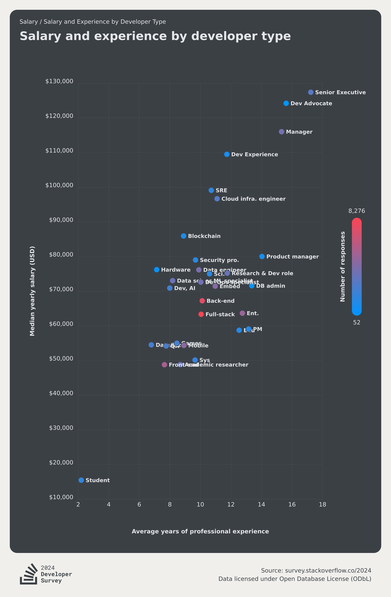

# Work Experience

This visualisation will be a verbatim copy of the one shown [here](https://survey.stackoverflow.co/2024/work#3-salary-and-experience-by-developer-type).

```js
const WorkExperienceResults = FileAttachment("./data/work_experience.json").json();
```

```js
display(WorkExperienceResults);
```




